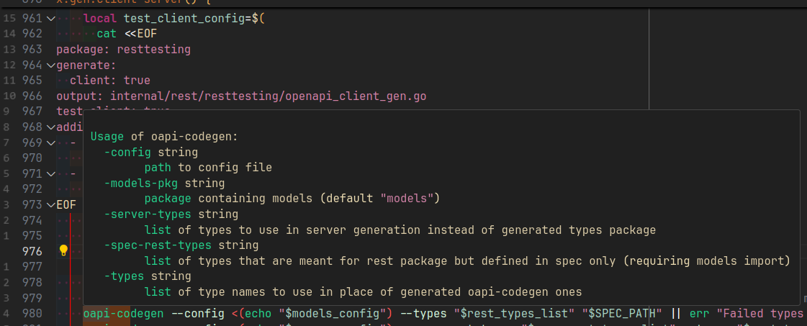

# vscode-command-help


Usage:

```json
"vscode-command-help.commands": [
      "oapi-codegen",
      "sqlc",
      "yq",
      "pnpm",
    ],
```



# Development

```
npm i
npm exec -- vsce package
```
